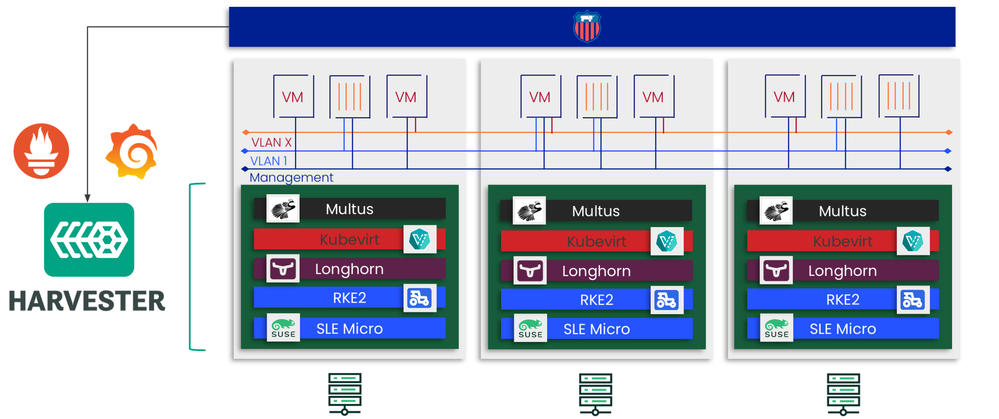
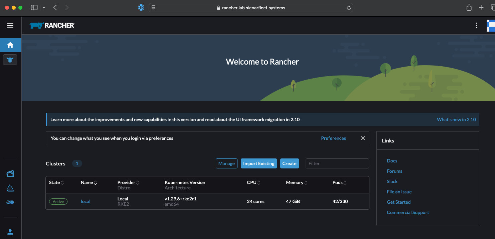
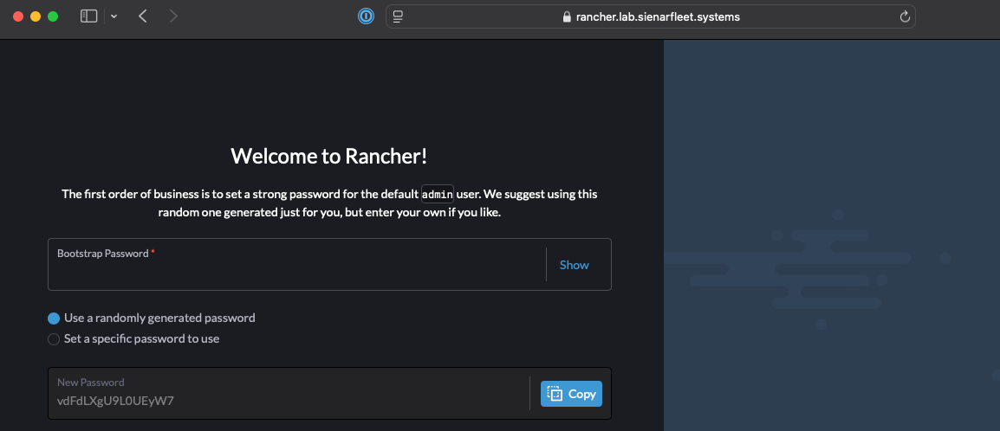
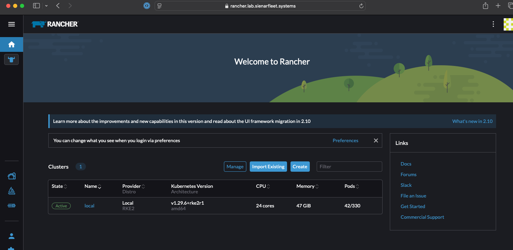

# Three Easy-mode ways of Installing Rancher onto Harvester

## Intro
Greetings! We are here to dive into Rancher's Harvester product and explore some of the synergies that emerge when we combine the infrastructure and orchestration layers using a unified API. That unified API is the Kubernetes API. So, instead of using the usual cloud-native tools in our toolbox (Terraform, Ansible, etc), we are going to try to use ONLY Kubernetes to deploy a guest RKE2 cluster onto Harvester and then install Rancher Multi-cluster Manager on that cluster. Ideally we do this with minimal steps and avoid usage of complex bash scripts.

I'm going to take a few extra minutes to explain HOW we take a base VM we would use for an RKE2 node and turning it into a Helmchart. I don't want to bog anything down so I'm sticking it in a separate doc that I will link below.

### Table of Contents

* Kubernetes CRDs and Harvester
* Helm Templating
* A Simple Helmchart for Harvester
* Installing Rancher Method 1 (Helm)

### Dependencies
There will be minimal dependencies here but the most notable one that you'll need in order to reproduce this demonstration is a running Harvester instance. Harvester can run on nearly anything. [Hop over to github](https://github.com/harvester/harvester/releases/tag/v1.4.0) and grab the iso if you haven't installed it yet.

Within Harvester, you'll need a VM Network that is routable within your network and a base vm image already preloaded.

## Kubernetes CRDs and Harvester

The true power of Kubernetes is not just being able to run containers. Its true power lay in HOW it runs containers. All resources in Kubernetes are defined using a common API. And the controllers, schedulers, etc all operate with objects defined by those APIs via abstraction.

These APIs are extensible via `CRDs` or `CustomResourceDefinitions`. This allows vendors, like Rancher, to create specific objects for their application within Kubernetes. Using these objects and APIs, an operator can also work with the application using various forms of automation and templating. 

In the end, Kubernetes' true power is how everything that it runs and controls is infrastructure-as-code or configuration-as-code. Harvester is a combination of Kubernetes products and relies on the unified APIs to manage everything it controls. This allows us to do all sorts of VERY cool things that we cannot do within VMware, Nutanix, or OpenStack!



## Helm Templating

Because everything can be defined by simple `yaml` or `json` configuration in Kubernetes, we can use various templating technologies in order to build more complex applications and only expose the config values we want. 

When defining a full configuration for an application, there will be a lot of data going into those configurations that you might want to hide away from the consumer of your template. You might even want to be able to generate more complex configurations based on small input data. To do this, we can use templating technologies.


This is where Helm comes in (and tools similar to it) in that it wraps `go-templating` up in a package with some other options and allows you to templatize a complex application configuration.

To take a deeper look at Helm, go checkout the [Helm webpage](https://helm.sh) that has a lot of good information for starters. And then with google or ChatGPT you can find many good examples out there of more complex helmcharts.

## A Simple Helmchart for Harvester
Because this topic will go in-depth, I'm going to put it here: [Basic Helmchart for Harvester](harvester_helmchart.md)

## Installing Rancher Method 1 (Helm)

Using the above-mentioned Helm path, I've written a (very) basic helmchart that will allow me to describe an RKE2 cluster with a set amount of nodes along with other configurables that go into it (like the static manifests we use to auto-install Rancher). Note that this is simple on-purpose because I could add in all kinds of features if I wanted but creating a feature-complete Helmchart is not useful for me here as that's not what I'm trying to illustrate.

### Preconfig Requirements

Currently, Harvster's loadbalancer works well but has a very prescriptive `ValidatingWebhook` that breaks different cloud patterns of LoadBalancer management. That issue is being rectified in 1.4.x, but it is easy to remove the webhook for the LoadBalancer using the command below:

```bash
kubectl delete ValidatingWebhookConfigurations harvester-load-balancer-webhook
```

### Configuration

I have hosted that helm chart [here](helm/rke2/) and included a [demo values file](helm/demo_values.yaml) that includes a few things we haven't discussed here. I have embedded the `Cert-Manager` and `Rancher` Helmchart CRDs here as static manifests. This is a simple solution to ensuring these helmcharts are installed as soon as RKE2 enters a `Ready` state. Feel free to edit this file to tailor to your own environment. 

Some notes on what to edit:
* LoadBalancer values (`control_plane.loadbalancer_gateway` `control_plane.loadbalancer_subnet` `control_plane.vip`) -- ensure your LB IP settings are on the host/mgmt network for now unless you want to add extra routing rules
* Static IP Network Config (`control_plane.network`) -- note this is an Ubuntu example, Rocky and RHEL look a little different
* SSH public key (`ssh_pub_key`) -- Ensure you have ownership of the key pair, we'll need it to hop onto the node if something goes wrong
* VM specs (`control_plane.cpu_count` `control_plane.memory_gb`)
* Network Name (`network_name`) -- the VM Network you created in Harvester that will host your VMs
* VM Image Name (`vm.image`) -- the name of the VM image you're using for your nodes.
* Rancher URL (`control_plane.files[].content`)-- set the embedded rancher URL to a domain you control or at least one you can set in your local `/etc/hosts`


## Installation

Once we have a good config, let's apply this helmchart to our Harvester cluster!

```console
❯ helm install rke2-mgmt -f demo_values.yaml rke2/
NAME: rke2-mgmt
LAST DEPLOYED: Fri Jan 10 14:08:05 2025
NAMESPACE: default
STATUS: deployed
REVISION: 1
TEST SUITE: None
```

I can immediately look at my Harvester UI and see 3 VMs starting!


A few seconds later, Harvester has assigned those VMs to different nodes and the VMs are now booting.


## Validation 

Once I give it a minute or two, I can use my SSH key to query the cloud-init state and see when RKE2 will be available:
```bash
export SSH_PRIVATE_KEY=$HOME/.ssh/infrakey
export RKE2_NODE_IP=10.2.0.21
ssh -i $SSH_PRIVATE_KEY -o UserKnownHostsFile=/dev/null -o StrictHostKeyChecking=no ubuntu@$RKE2_NODE_IP "while [ ! -f /var/lib/cloud/instance/boot-finished ]; do echo 'Waiting for Cloud-Init...'; sleep 5; done"
```

Once I know RKE2 is up, I can use a similar command to grab my kubeconfig off the node and modify it with the VIP value:
```bash
export SSH_PRIVATE_KEY=$HOME/.ssh/infrakey
export RKE2_NODE_IP=10.2.0.21
export VIP=$(helm get values rke2-mgmt | grep vip: | awk '{printf $2}')
ssh -i $SSH_PRIVATE_KEY -o UserKnownHostsFile=/dev/null -o StrictHostKeyChecking=no ubuntu@$RKE2_NODE_IP "sudo cat /etc/rancher/rke2/rke2.yaml" 2> /dev/null | \
sed "s/127.0.0.1/${VIP}/g" > kube.yaml
chmod 600 kube.yaml
```

I check the node state here:
```console
❯ kubectl --kubeconfig kube.yaml get nodes
NAME             STATUS   ROLES                       AGE   VERSION
rke2-mgmt-cp-0   Ready    control-plane,etcd,master   11m   v1.29.6+rke2r1
rke2-mgmt-cp-1   Ready    control-plane,etcd,master   10m   v1.29.6+rke2r1
rke2-mgmt-cp-2   Ready    control-plane,etcd,master   10m   v1.29.6+rke2r1
```

Now I check Rancher's state and see that it is running!
```console
❯ kubectl --kubeconfig kube.yaml get po -n cattle-system
NAME                                         READY   STATUS      RESTARTS        AGE
helm-operation-bxftn                         0/2     Completed   0               8m13s
helm-operation-hrwgj                         0/2     Completed   0               8m38s
helm-operation-l87jh                         0/2     Completed   0               7m35s
helm-operation-lrpnt                         0/2     Completed   0               9m10s
helm-operation-mk6zt                         0/2     Completed   0               8m2s
helm-operation-sjvb4                         0/2     Completed   0               7m25s
helm-operation-vnrhf                         0/2     Completed   0               7m5s
helm-operation-xxqgl                         0/2     Completed   0               8m19s
rancher-7d8f64bfc6-8v4wx                     1/1     Running     1 (9m56s ago)   10m
rancher-7d8f64bfc6-rzqnb                     1/1     Running     1 (9m56s ago)   10m
rancher-7d8f64bfc6-z2h6v                     1/1     Running     0               10m
rancher-webhook-bfd464697-rk7dh              1/1     Running     0               7m59s
system-upgrade-controller-646f9548cc-pkzvk   1/1     Running     0               7m32s
```

I verify Rancher is up by going to the UI. I configured my URL to be `rancher.lab.sienarfleet.systems`. If I did not have control over my DNS, I would need to make an entry in `/etc/hosts` on my MacBook. But I'm good. So opening the browser reveals the running rancher instance:


I set my bootstrap password to `admin` when I setup my helm values, so I add that and sign-in. I then see the Rancher UI for 2.10.1! I've now successfully installed Rancher on a guest RKE2 cluster using a simple helmchart!


## Installing Rancher Method 2 (Fleet)
This method is new and takes advantage of the new Fleet integration with Harvester. We'll be using the HelmChart we used from the [Method 1]() section here  here. There are two ways to do this, one requires having a git repo available within your envionment (or from the internet if you have access) and the other doesn't require git. 

Creating the second version is a bit tedious unless you can create the first version. The reason for this is because the first version uses Fleet's GitOps capability by referencing a remote git repo that contains both the RKE2 helmchart and values. When consumed by `Fleet` this data creates a `Bundle` object inside of Harvester/Fleet. Fleet uses Bundle objects to do automation work as a Bundle describes a set of discovered resources and how to process them. The second method here uses a `Bundle` directly and creating them can be a little toilsome.

To avoid that issue, I'm including a prebuilt one that contains the helmchart in its current state as of Jan 8th 2025. The `Bundle` file is the [Management Cluster config](./fleet/mgmt.yaml) file. 

In a real production environment, we would likely opt for the first version using a true GitOps approach to managing this cluster. But now for simplicity, we'll just use the Bundle.

### Preconfig Requirements

Currently, Harvster's loadbalancer works well but has a very prescriptive `ValidatingWebhook` that breaks different cloud patterns of LoadBalancer management. That issue is being rectified in 1.4.x, but it is easy to remove the webhook for the LoadBalancer using the command below:

```bash
kubectl delete ValidatingWebhookConfigurations harvester-load-balancer-webhook
```

### Configuration
Edit the [Management Cluster config](./fleet/mgmt.yaml) file and set all values appropriately. Note here, unlike the pure helm version, we need to inject some values ourselves into the Bundle CRD. The values we are editing reside in the yaml path `.spec.helm.values`.

Ensure these are set correctly:
* LoadBalancer values (`control_plane.loadbalancer_gateway` `control_plane.loadbalancer_subnet` `control_plane.vip`) -- ensure your LB IP settings are on the host/mgmt network for now unless you want to add extra routing rules
* Static IP Network Config (`control_plane.network`) -- note this is an Ubuntu example, Rocky and RHEL look a little different
* SSH public key (`ssh_pub_key`) -- Ensure you have ownership of the key pair, we'll need it to hop onto the node if something goes wrong
* VM specs (`control_plane.cpu_count` `control_plane.memory_gb`)
* Network Name (`network_name`) -- the VM Network you created in Harvester that will host your VMs
* VM Image Name (`vm.image`) -- the name of the VM image you're using for your nodes.
* Rancher URL (`control_plane.files[].content`)-- set the embedded rancher URL to a domain you control or at least one you can set in your local `/etc/hosts`

### Installation

Installation is EASY. Just point your kube context to your Harvester cluster and fire away!
```bash
kubectl apply -f fleet/mgmt.yaml
```

Once the `Bundle` is created in Harvester, Fleet will immediately begin trying to install the embedded HelmChart. You should quickly see VMs start spinning up in Harvester, assuming your config values were correct.

### Validation

Once helm has installed the release that creates the RKE2 cluster, you can wait for the first node to come online (it waits for cloud-init). Set the env vars correctly.
```bash
export SSH_PRIVATE_KEY=$HOME/.ssh/infrakey
export RKE2_NODE_IP=10.2.0.21
ssh -i $SSH_PRIVATE_KEY -o UserKnownHostsFile=/dev/null -o StrictHostKeyChecking=no ubuntu@$RKE2_NODE_IP "while [ ! -f /var/lib/cloud/instance/boot-finished ]; do echo 'Waiting for Cloud-Init...'; sleep 5; done"
```

So the install process goes like this: RKE2 -> Cert-manager -> Rancher. On my system, this takes about 7min to install in total and I am not doing any airgap stuff. When airgapping everything, it is significantly faster (5min or less).

If you want to peek at progress, you can use the kubeconfig of the cluster once it is up to watch for Rancher starting. After Rancher has started, congrats, you're done!

Once the first node is in a ready state, you can fetch the kubeconfig from the node using the below command and set the VIP value inside it. Set the env vars correctly.
```bash
export SSH_PRIVATE_KEY=$HOME/.ssh/infrakey
export RKE2_NODE_IP=10.2.0.21
export VIP=$(helm get values mgmt-cluster | grep vip: | awk '{printf $2}')
ssh -i $SSH_PRIVATE_KEY -o UserKnownHostsFile=/dev/null -o StrictHostKeyChecking=no ubuntu@$RKE2_NODE_IP "sudo cat /etc/rancher/rke2/rke2.yaml" 2> /dev/null | \
sed "s/127.0.0.1/${VIP}/g" > kube.yaml
chmod 600 kube.yaml
```

I check the node state here:
```console
❯ kubectl --kubeconfig kube.yaml get nodes
rke2-mgmt-cp-0   Ready    control-plane,etcd,master   2m22s   v1.29.6+rke2r1
rke2-mgmt-cp-1   Ready    control-plane,etcd,master   65s     v1.29.6+rke2r1
rke2-mgmt-cp-2   Ready    control-plane,etcd,master   73s     v1.29.6+rke2r1
```

Now I check Rancher's state and see that it is running!
```console
❯ kubectl --kubeconfig kube.yaml get po -n cattle-system
NAME                              READY   STATUS      RESTARTS   AGE
helm-operation-67v2c              0/2     Completed   0          66s
helm-operation-9hmjw              0/2     Completed   0          80s
helm-operation-9l4kh              0/2     Completed   0          27s
helm-operation-lcfkf              0/2     Completed   0          37s
rancher-7d8f64bfc6-4hcqx          1/1     Running     0          2m5s
rancher-7d8f64bfc6-vkph6          1/1     Running     0          2m5s
rancher-7d8f64bfc6-zd7tr          1/1     Running     0          2m5s
rancher-webhook-bfd464697-fzhlr   1/1     Running     0          24s
```

I can now go to the UI and verify just like in method 1:


And now I use the `admin` bootstrap password and log into Rancher. Success!


## Installing Rancher Method 3 (CAPI)
This will cover an experimental and PoC-grade addon for Harvester that can be used to install an RKE2 guest cluster into Harvester directly without requiring any external tools or dependencies outside of what Harvester comes with. This installs a full-blown version of Rancher onto a guest cluster. In the past you would use Terraform or Ansible for this, but now we do not need it.

### Explanation
ClusterAPI functions on the notion of using Kubernetes clusters to create other downstream clusters. In this case, I create a CAPI `Management` cluster using a `bootstrap` pattern. I choose to use [Loft Labs vCluster](https://www.vcluster.com) to do this. In short, it creates a cluster inside of Harvester's RKE2 cluster that runs inside of a single pod. As part of that, it will map external ingress/egress into the Pod. vCluster is a very cool technology that is exploding in popularity! I will use it to create a CAPI bootstrap cluster that I then point at my local Harvester cluster to install a guest RKE2 cluster. Note this does not use Helm or any other external tools other than CAPI's Operator.

CAPI functions on the topology of `Providers`. They 'provide' various capability at different layers in the stack. There are `Infrastructure` providers as well as `Bootstrap` providers and other things. We will utilize the Harvester `Infrastructure Provider` which is currently in Beta and the RKE2 `ControlPlane Provider` which is GA.

There are limitations here:
* The Harvester Infra Provider has a few limitations including
  * Requiring embedding a Harvester kubeconfig with a very specific name in base64 format
  * CPU counts do not reflect actual CPU consumption due to a provisioning bug (desired cpu cores end up being pasted into sockets and threads making true core count ^3 of desired amount)
  * LoadBalancing requires usage of DHCP and cannot do static IP assignment inline (yet)
  * Using agentConfig.additionalUserData field in RKE2ControlPlane objects will break the Harvester provider
  * Currently there is no way to manage static IP addresses for control plane nodes, this makes DHCP a requirement.
  * The VM instances in Harvester have hardcoded cloud-init configurations and do not support any flags such as UEFI, so UEFI-only OS's such as Rocky will likely not work
* The Harvester Addon has hardcoded UI elements, so using a custom Addon will not render any fields and requires manual yaml editing
* RKE2's ControlPlane Provider does not take IPAM into account and prescriptively names the nodes using a guid with no option for an index -- so static IP assignment at the operating system level is impossible due to the non-determinism.
* CAPI design views powercycling of nodes as an outlier case, making it less friendly to Kubernetes at the Edge.

This is a cool glimpse at what the future could be in a CAPI world, but it still has a few hurdles to overcome.

### Known Issues
* vcluster uses stateful sets and does not by default clean up its volumes, this can cause issues if you repeatedly use it as the existing kubernetes state of vcluster will be resumed vs being reinstalled. So ensure you delete the PVC

### Installation

#### Addon Mode

Install the addon into the Harvester cluster as-is:

```bash
kubectl apply -f addon.yaml
```

Once installed, go to the Harvester Addons menu under Advanced->Addons and click the `...` menu to the right on the `rancher-embedded` addon. Click `Edit Config`.

Click the `Enable` button and then select `Edit Yaml` at the bottom. From here is where you will edit the values in the addon at the top.

The values to edit are:
```yaml
    vm_network_name: ""
    ssh_keypair: ""
    vm_image_name: ""
    vm_default_user: ""
    harvester_vip: ""
    rancher_url: ""
    harvester_kubeconfig_b64: ""
```

Everything should be obvious here except for the harvester kubeconfig. The easiest path is to go to download the harvester kubeconfig file and then convert it into base64.

On Linux, base64 requires `-w0` and MacOS does not
```bash
#linux
cat ~/Downloads/local.yaml | base64 -w0
#macos
cat ~/Downloads/local.yaml | base64
```

Once the values are placed into the appropriate fields, hit 'save'. 

#### HelmChart CRD Mode
Or if you prefer to skip the addon steps, just use the [helmchart file](./helmchart.yaml) directly. This uses the `envsubst` command in order to set your config files inline. I created a snippet for the kubeconfig value that assumes you Harvester kubeconfig is set to a specific context. Feel free to remove the first `use-context` command from the chain if you are only using a single file or just use the instructions in the Addon section for manually download the kubeconfig.

```bash
export VM_NETWORK="lab-workload"
export VM_SSH_KEYPAIR="command"
export VM_IMAGE_NAME="ubuntu"
export VM_DEFAULT_USER="ubuntu"
export HARVESTER_VIP="10.2.0.20"
export RANCHER_URL="rancher.lab.sienarfleet.systems"
export HARVESTER_CONTEXT_NAME=lab
export HARVESTER_KUBECONFIG_B64=$(kubectl config use-context ${HARVESTER_CONTEXT_NAME} &>/dev/null && kubectl config view --minify --flatten | yq '.contexts[0].name = "'${HARVESTER_CONTEXT_NAME}'"' | yq '.current-context = "'${HARVESTER_CONTEXT_NAME}'"' | yq '.clusters[0].name = "'${HARVESTER_CONTEXT_NAME}'"' | yq '.contexts[0].context.cluster = "'${HARVESTER_CONTEXT_NAME}'"' | base64 -w0); \

cat helmchart.yaml | envsubst | kubectl apply -f -
```

### Validation

Underhood, the first thing that will happen is Harvester will attempt to install a vcluster instance into the bare metal RKE2 cluster.

After the cluster starts, it will run the pods in the local Harvester cluster using specific names and also within the same namespace as the vcluster instance (think of it like a pass through). Using this addon will place that into the default namespace for now. At first this will be the various controller for the CAPI Providers. But once they start, they will begin creating CAPI objects inside of Harvester itself.

You can watch progress using `watch kubectl get po`. It takes a few minutes for all of the orchestration to work including the CAPI components/providers to be installed. 

Once everything is running it will look something like this:
```console
❯ kubectl get po
NAME                                                              READY   STATUS             RESTARTS         AGE
bootstrap-cluster-cluster-api-operator-bfcf86f56-54q-978a8b9abb   1/1     Running            0                3m44s
caphv-controller-manager-b64f46f7b-w5b87-x-caphv-sys-66f8057b1a   2/2     Running            0                2m55s
capi-controller-manager-c4479f749-62j2c-x-capi-syste-f97a3e30d8   1/1     Running            0                3m17s
cert-manager-5d58d69944-hflsl-x-cert-manager-x-rancher-embedded   1/1     Running            0                4m36s
cert-manager-cainjector-54985976df-jpdjx-x-cert-mana-b5e7d084b7   1/1     Running            0                4m36s
cert-manager-webhook-5fcfcd455-2tbff-x-cert-manager--5585ffcae7   1/1     Running            0                4m37s
coredns-5964bd6fd4-ppnd4-x-kube-system-x-rancher-embedded         1/1     Running            0                4m45s
helm-install-bootstrap-cluster-hlll2-x-default-x-ran-d190cab10a   0/1     Completed          3                4m45s
helm-install-cert-manager-c25q6-x-default-x-rancher-embedded      0/1     Completed          0                4m45s
helm-install-rancher-embedded-m22c9                               0/1     Completed          0                5m18s
rancher-embedded-0                                                1/1     Running            0                5m13s
rke2-bootstrap-controller-manager-d7ff5c66b-s8rkd-x--ca2813698c   1/1     Running            0                2m49s
rke2-control-plane-controller-manager-7f6559b6bd-plw-b5d3f978b8   1/1     Running            0                2m49s
virt-launcher-rke2-mgmt-cp-machine-r2dcm-q649c                    2/2     Running            0                2m34s
```

After a short time, you'll see the VMs begin to be created. Note the `virt-launcher` pods that are associated with them. CAPI creates them one after the other.

We need to get the IP address of the load balancer so we can set our rancher DNS entry. We can do that by viewing the LoadBalancer UI in Harvster under Networks->LoadBalancers:


It says 10.2.0.117. So I will edit my `/etc/hosts` entry to point at the correct IP. I don't want to disrupt my normal DNS entry since I use that elsewhere. etc-hosts entries are good for a temporary test.

I can see that I need to sign in with the bootstrap password here (admin):


I sign in and see the Rancher dashboard!
